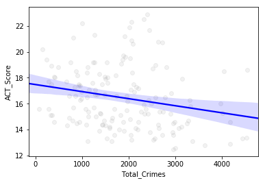

**Students:** Xiaofan Liu and Yuewen Ding

**Date:** Nov. 30, 2017

## Targets

Students’ decisions making process on future education is influenced by a combination of factors, including but not limited to their past academic achievements, quality of schools, interests and external environment. The key question for policy makers is how we could improve the education environment in the most cost-effective way. Based on a survey conducted in Ohio, safety is the top one concern when choosing schools for their children. It is important to figure out following questions: Does safety (crime rate nearby the location of a school) affect school performances that are considered for choices making? If so, to what extent? Does it have the same effect on students in different aspects (such as ACT score, college enrollment) or by different types of crimes? The targets of this project is to understand the data correlations between performances Chicago high schools and the safety (crime rates) of their locations. All data used in the study is for the 2016-2017 school year (Sep. 1, 2016 to Aug. 31, 2017). The school performance data are 181 high schools in Chicago, and the crime data are case records of the Chicago city.

## Data Preparation

The scripts that were used to prepare all data set are put in this folder, and data files are stored in the [`data`](https://github.com/yuewending/PPHA30550_Final_Project/blob/master/data) folder.

### Performance Data of High Schools

The performance data are from several different portals but they are all from [Chicago Public Schools (CPS)](http://www.cps.edu/) originally. CPS assign each school a unique **School ID** in all different data sets and studies, so it helps us combine variables from multiple files by matching the **School ID**.

#### High School Progress Report Cards

This is an annual report from each CPS high school, including the summary how the school is doing. However, most of the variables were given as ranks or percentiles, which is not easily to be used as a straightforward quantative indicators. We use the data set to extract the basic information of the schools: **Schoo ID, Name, Latitude, Longitude.** Another variable we use from it is the **"Safety Level"** obtained from parents/students survey. The safety descriptions are in the options of "VERY WEAK", "WEAK", "NEUTRAL", "STRONG" and "VERY STRONG", which will be converted into numbers 1~5, and the higher the better safety assessment.

**Step:** run the python script "`query_progress.py`" in this folder

**Output files:** 
  1. `data/raw_progress.csv` The raw data downloaded via Chicago Data Portal.
  2. `data/refined_progress.csv` The refined data file containing target variables only.
  3. `data/school_id.csv` an one-column list containing all School IDs.
  
  
  
#### School Ratings

[School Quality Rating Policy (SQRP)](http://cps.edu/Performance/Pages/PerformancePolicy.aspx) is an important indicator to assess the shcool performance. However, there's no direct data portal or formatted files can be found. The rating can be only seen from the pages for each school on CPS website. The rating are "Level 1+", "Level 1", "Level 2+", "Level 2", "Level 3", from the best to the worst. These ratings were converted to numbers 1 to 5, and the higher the better. (5 means Level 1+).

The Python script was written to obtain the data. The URL is in the format "`http://schoolinfo.cps.edu/schoolprofile/SchoolDetails.aspx?SchoolId=[School ID]`".

**Step:** run the python script "`query_rating.py`" in this folder

**Input file:** `data/school_id.csv` Used to provide the list of School IDs

**Output files:** . `data/ratings.csv` The result file contains school IDs and ratings (**Level**)

#### High School Assessment Reports and Metrics

CPS provides many useful data sets via its [School Data](http://cps.edu/SchoolData/Pages/SchoolData.aspx) page. These data sets are provided in Excel format. We downloaded datasheet and use Python/Pandas to extract the columns that we need, as well as the School ID column for matching. We used three files in this study with variables: **"11th Grade ACT Scores", "5-year Graduation Percentages" and "After 2-Year College Enrollment Percentages".**

**Step:** run the python script "`query_act.py`", "`query_graduation.py`","`query_college.py`" in this folder

**Output files:** 
  1. `data/raw_[XXX].xls` The raw data downloaded from CPS.
  2. `data/refined_[XXX].csv` The refined data file containing target variables only.

### Crime Data

Crime data are from [Chicago Data Portal](https://data.cityofchicago.org). We downloaded the data sets for 2016 and 2017 to cover the 2016 school year. Data sets are in CSV file, and contains 268520 criminal cases and 22 variables. In this study, we only use **"Case ID", "Crime Type", "Latitude" and "Longitude" **.

The key to this project is matching the crime data to schools to reflect the safety conditions of the neighborhood. Here we used the number of cases within 1km distance to the school as the variable. Therefore, We mapped the criminal cases to schools with their latitudes and longitude. The python script is provided to download the raw data and map them to the schools.

**Step:** run the python script "`map_crime.py`" in this folder

**Output files:** 
  1. `data/crime_2016.csv` Raw data file for crimes in 2016
  2. `data/crime_2017.csv` Raw data file for crimes in 2017
  3. `data/refined_crime_sy2016.csv` Data set with criminal cases in 2016-2017 school year
  4. `data/school_crimes.csv` Mapping files for criminial cases and schools.
  5. `data/crime_types.csv` Types of criminal cases and corresponding IDs.

The `school_crimes.csv` file contains 4 columns: **"Crime ID", "Crime Type", "School ID", and "Distance".** Note that one case may be matched to multiple schools. Overall, 351644 relations were found, and 184365 cases were happened with 1km of schools.

### Finalize the Data Table

Different data sets for school performances were merged by School IDs, and the numbers of criminal cases happend in each school's neighbor were counted and added as a new column to the school data. Therefore, finally we obtained a single table representing the data to be analyzed. Each row of the table is the information of a school, while each column is a variable for either school performance or safety.

**Step:** run the python script "`finalize_data.py`" in this folder

**Output files:** `data/data_table.csv`

## Data Analysis

All analysis code for this project is included in a single jupyter notebook:

[data_analyze.ipynb](https://github.com/yuewending/PPHA30550_Final_Project/blob/master/data_analyze.ipynb)

### Overview of Data

First, the counts of schools on different SQRP ratings and safety levels are plotted below. For the SQRP ratings, schools with higher numbers have better qualities. For the safety levels, schools with higher numbers have more responses with safer neighborhoods. **Because most of schools have very low safety levels (1~3), most parents and students are not satisfied with the neighborhood safety around the schools**

 

Then, counts of schools with different performance variables are shown below. These plots can reflect the overall performances of Chicago high schools.

  

Last, the crime data are visualized below. Left is the counts histogram categoried by number of crimes. Most of neighborhoods nearby high schools have less than 3000 crime reports over the year (left). The right panel is the geographic plotting of the schools on the Chicago map, and the colors represent the number of crime reports. It demostrate a strong clusterring pattern. Mid-west region has the most dangerous neighborhoods, while the safest neighborhoods are near the north and south border of Chicago.

 

The schools in the safest neighborhoods are:

Short_Name | Level | Safety_Level | Total_Crimes
-----------| ----- | ------------ | ------------
OMBUDSMAN - NORTHWEST HS | NaN | 3.0 | 81.0
CHICAGO AGRICULTURE HS | 5.0 | 3.0 | 154.0
CICS - NORTHTOWN HS | 5.0 | 3.0 | 234.0
WASHINGTON HS | 4.0 | 2.0 | 279.0
SOCIAL JUSTICE HS | 3.0 | 2.0 | 285.0
PATHWAYS - ASHBURN HS | NaN | 4.0 | 332.0
TAFT HS | 4.0 | 2.0 | 345.0
WORLD LANGUAGE HS | 5.0 | 2.0 | 345.0
YCCS - OLIVE HARVEY | NaN | 2.0 | 350.0
MULTICULTURAL HS | 3.0 | 2.0 | 397.0

The schools in the most dangerous neighborhoods are:

Short_Name | Level | Safety_Level | Total_Crimes
-----------| ----- | ------------ | ------------
NOBLE - DRW HS | 3.0 | 2.0 | 4549.0
YCCS - CCA ACADEMY | NaN | 2.0 | 4536.0
YCCS - SCHOLASTIC ACHIEVEMENT | NaN | 2.0 | 4444.0
MAGIC JOHNSON - N LAWNDALE HS | NaN | 3.0 | 4177.0
AUSTIN CCA HS | 2.0 | 1.0 | 4173.0
NOBLE - ROWE CLARK HS | 3.0 | 1.0 | 4045.0
NORTH LAWNDALE - CHRISTIANA HS | 2.0 | 1.0 | 4009.0
LEGAL PREP HS | 3.0 | 2.0 | 3978.0
YCCS - AUSTIN CAREER | NaN | 2.0 | 3630.0
HIRSCH HS | 2.0 | 3.0 | 3362.0

### Scatter Matrix Analysis of Selected Variables

The pair-wise scatter plots are shown below for performance variables and the total crime predictor. Strong correlations can be observed from the performance variables (ACT, Graudation and College enrollment). It implies that the three variables we selected are good indicator to assess the qualities of high schools, and their trends are in good agreement.

### Regressions on Total Crimes

Regression analysis with OLS method was used on the varible of total crimes. The plots and trend lines for the four performance variables are shown below. All of them display clear trends that higher crime rates will lower the performance.

 

 

The statistics parameters are summarized in the table below. All the slope coeffients are negative and statistically significant (>95% probabilities that the true values are not zero).

Dependent | Slope | T-value | Pr | R-square
--------- | ----- | ------- | -- | --------
SQRP rating | -0.0003 | -3.130 | 0.002 | 0.075
ACT Score | -0.0005 | -2.832 | 0.005 | 0.050
Graduation rate | -0.0034 | -2.858 | 0.005 | 0.069
College rate | -0.0049 | -2.493 | 0.014 | 0.043

### Multivariable Regressions on Differnt Types of Crimes

The results of multivariable regressions on different types of crimes are listed below. Statistically significant dependences can be only found with the type of battery crimes to the performances of SQRP rating, ACT score and College enrollment percentage. No dependence can be found for the graduation rate.

**SQRP** | coef | std err | t | Pr | \[0.025 | 0.975\]
-------- | ---- | ------- | - | -- | ------ | ------
Intercept | 3.7039 | 0.335 | 11.043 | 0.000 | 3.038 | 4.370
Total_Thefts | 5.327e-05 | 0.001 | 0.084 | 0.934 | -0.001 | 0.001
Total_Batteries | -0.0040 | 0.003 | -1.567 | 0.120 | -0.009 | 0.001
Total_Assaults | 0.0044 | 0.006 | 0.685 | 0.495 | -0.008 | 0.017
Total_Robberies | 0.0057 | 0.005 | 1.228 | 0.222 | -0.003 | 0.015
Total_Weapon_Violations | 0.0005 | 0.008 | 0.062 | 0.951 | -0.016 | 0.017
Total_Homicides | -0.0165 | 0.038 | -0.432 | 0.666 | -0.092 | 0.059

**ACT Score** | coef | std err | t | Pr | \[0.025 | 0.975\]
------------- | ---- | ------- | - | -- | ------ | ------
Intercept | 16.3955 | 0.578 | 28.347 | 0.000 | 15.251 | 17.540
Total_Thefts | 0.0021 | 0.001 | 1.862 | 0.065 | -0.000 | 0.004
Total_Batteries | -0.0098 | 0.004 | -2.216 | 0.029 | -0.019 | -0.001
Total_Assaults | 0.0178 | 0.011 | 1.603 | 0.112 | -0.004 | 0.040
Total_Robberies | 0.0012 | 0.008 | 0.160 | 0.873 | -0.014 | 0.017
Total_Weapon_Violations | 0.0024 | 0.013 | 0.175 | 0.861 | -0.024 | 0.029
Total_Homicides | 0.0036 | 0.065 | 0.056 | 0.956 | -0.125 | 0.132

**Grad. Rate** | coef | std err | t | Pr | \[0.025 | 0.975\]
-------------- | ---- | ------- | - | -- | ------ | ------
Intercept | 82.9635 | 3.652 | 22.714 | 0.000 | 75.701 | 90.226
Total_Thefts | 0.0019 | 0.008 | 0.245 | 0.807 | -0.013 | 0.017
Total_Batteries | -0.0289 | 0.028 | -1.041 | 0.301 | -0.084 | 0.026
Total_Assaults | -0.0025 | 0.068 | -0.036 | 0.971 | -0.139 | 0.134
Total_Robberies | 0.0484 | 0.053 | 0.913 | 0.364 | -0.057 | 0.154
Total_Weapon_Violations | 0.1191 | 0.090 | 1.321 | 0.190 | -0.060 | 0.298
Total_Homicides | -0.7393 | 0.424 | -1.746 | 0.085 | -1.581 | 0.103

**Col. Pct.** | coef | std err | t | Pr | \[0.025 | 0.975\]
------------- | ---- | ------- | - | -- | ------ | ------
Intercept | 49.7486 | 6.235 | 7.978 | 0.000 | 37.393 | 62.104
Total_Thefts | 0.0277 | 0.013 | 2.093 | 0.039 | 0.001 | 0.054
Total_Batteries | -0.1129 | 0.046 | -2.478 | 0.015 | -0.203 | -0.023
Total_Assaults | 0.2278 | 0.115 | 1.987 | 0.049 | 0.001 | 0.455
Total_Robberies | -0.0710 | 0.088 | -0.809 | 0.420 | -0.245 | 0.103
Total_Weapon_Violations | 0.1251 | 0.140 | 0.894 | 0.373 | -0.152 | 0.402
Total_Homicides | 0.0288 | 0.695 | 0.041 | 0.967 | -1.348 | 1.406
